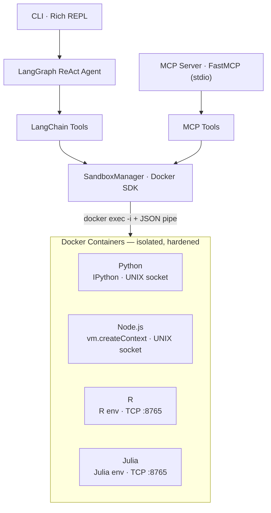
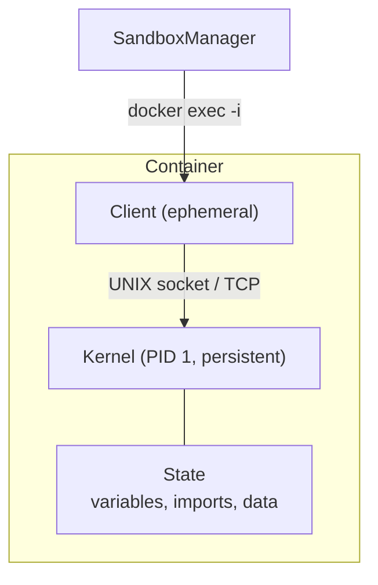

# Sandbox Agent

LangGraph agent with Docker-based sandboxed code execution. Each session runs in an isolated Docker container with a persistent kernel — IPython for Python, `vm.createContext` for Node.js, a dedicated R environment, and a Julia REPL. Supports 4 runtimes, provider-agnostic LLM configuration, and vision (auto-detection of multimodal models). Available as an interactive CLI or as an MCP server for integration with Cursor, Claude Desktop, and other MCP-compatible clients.

## Features

- **Docker isolation** — each session runs in its own container, no ports exposed, no host volumes
- **Hardened containers** — non-root user (UID 65532), PID limits, memory+swap limits, tmpfs-only writable dirs, `no-new-privileges`
- **Crash detection** — OOM-kill, fork bombs, segfaults are detected and reported clearly to the agent
- **Persistent state** — variables survive between code executions (like Jupyter cells)
- **Async support** — Promises (Node.js) and coroutines (Python) are automatically awaited
- **Multi-runtime** — Python, Node.js, R, and Julia
- **Vision support** — auto-detects multimodal LLMs and sends matplotlib/ggplot figures as base64 PNG images
- **Provider-agnostic** — works with OpenAI, Anthropic, or any compatible provider via `langchain-openai` init
- **Runtime package install** — `pip install` / `npm install` / `install.packages()` / `Pkg.add()` at session creation or via terminal
- **5 tools** — create_session, execute_code, execute_terminal, upload_file, stop_session
- **MCP server** — expose the same tools via Model Context Protocol (stdio transport)
- **Auto-cleanup** — all containers are stopped and removed when the agent exits

## Prerequisites

- Python 3.11+
- Docker Engine
- API key for your LLM provider (`CHAT_MODEL_API_KEY`)

## Setup

```bash
# Docker — installs (if needed), configures permissions, and builds all 4 images
sudo ./setup-docker.sh

# Install dependencies (open a new terminal so the docker group is active)
uv sync

# Configure environment
cp .env.example .env
# Edit .env with your CHAT_MODEL_API_KEY and LLM settings

# Docker images are also built automatically on first use if not already present
```

## Usage

### CLI

```bash
uv run sandbox-agent
```

The interactive CLI uses [Rich](https://github.com/Textualize/rich) for syntax-highlighted tool I/O panels, streaming agent output with Markdown rendering.

### MCP Server

Run the MCP server (stdio transport) for integration with Cursor, Claude Desktop, or any MCP-compatible client:

```bash
uv run sandbox-agent-mcp
```

#### Cursor

Add to `~/.cursor/mcp.json`:

```json
{
  "mcpServers": {
    "sandbox-agent": {
      "command": "uv",
      "args": ["--directory", "/path/to/sandbox-agent", "run", "sandbox-agent-mcp"]
    }
  }
}
```

#### Claude Desktop

Add to the Claude Desktop MCP config:

```json
{
  "mcpServers": {
    "sandbox-agent": {
      "command": "uv",
      "args": ["--directory", "/path/to/sandbox-agent", "run", "sandbox-agent-mcp"]
    }
  }
}
```

The MCP server exposes the same 5 tools as the CLI agent. The `upload_file` tool accepts file content directly (as text or base64) since MCP clients don't share a filesystem with the server.

### Programmatic

```python
from sandbox_agent.sandbox import SandboxManager

manager = SandboxManager()

info = manager.create_session(
    runtime="python",
    dependencies={"pandas": "2.2.3", "matplotlib": ""},
)
sid = info.session_id

r1 = manager.execute_code(sid, """
import pandas as pd
df = pd.DataFrame({'x': [1, 2, 3], 'y': [4, 5, 6]})
print(df.describe())
""")
print(r1.stdout)

# Variables persist between calls
r2 = manager.execute_code(sid, "df.shape")
print(r2.result)

manager.stop_session(sid)
```

Other runtimes work the same way — pass `runtime="node"`, `runtime="r"`, or `runtime="julia"` to `create_session`.

### Async Code

**Node.js** — if the last expression returns a Promise, the kernel awaits it before collecting output. Top-level `await` is also supported (falls back to an async IIFE wrapper when needed).

```javascript
const axios = require('axios');
async function fetchData() {
    const resp = await axios.get('https://api.example.com/data');
    console.log(resp.data);
}
fetchData(); // Promise is awaited automatically
```

**Python** — IPython's `autoawait` handles top-level `await`. If a cell returns an unawaited coroutine, the kernel detects it and runs it with `asyncio.run()`.

```python
import aiohttp

async def fetch_data():
    async with aiohttp.ClientSession() as session:
        resp = await session.get('https://api.example.com/data')
        print(await resp.text())

fetch_data()  # coroutine is detected and executed automatically
```

## Container Security

Each container is created with the following protections:

| Protection | Setting | Effect |
|---|---|---|
| Memory limit | `2048m` (no swap) | OOM-kill on overflow, host unaffected |
| PID limit | `512` | Fork bombs are contained and killed |
| CPU quota | `2` cores | Prevents CPU starvation on host |
| Writable dirs | tmpfs only (`/workspace`, `/tmp`, `/home/sandbox`) | Cannot fill host disk |
| tmpfs size | `200m` per mount | Limits in-container disk usage |
| User | `sandbox` (UID 65532) | No root inside container |
| Privileges | `no-new-privileges` | Cannot escalate via setuid/setgid |
| Network | Configurable (enabled by default) | Can be disabled per session |

When a container crashes, the agent receives a clear `CONTAINER_DIED` error with the reason (OOM-killed, SIGKILL, segfault, etc.) and a hint to recreate the session.

## Configuration

All settings can be overridden via environment variables or `.env`:

```bash
# LLM (provider-agnostic)
CHAT_MODEL=gpt-4o                    # Model name
CHAT_MODEL_PROVIDER=openai           # Provider (openai, anthropic, etc.)
CHAT_MODEL_BASE_URL=...              # Custom API base URL (optional)
CHAT_MODEL_API_KEY=sk-...            # API key (required)
CHAT_MODEL_SUPPORTS_VISION=          # Override vision detection (true/false, empty = auto)

# Container limits
CONTAINER_MEMORY_LIMIT=2048m         # Docker memory limit (no swap)
CONTAINER_CPU_QUOTA=200000           # CPU quota (100000 = 1 core)
CONTAINER_PIDS_LIMIT=512             # Max PIDs per container
CONTAINER_TMPFS_SIZE=200m            # tmpfs size for writable dirs
EXECUTION_TIMEOUT_SECONDS=30         # Default code execution timeout
MAX_SESSIONS=5                       # Maximum concurrent sandbox sessions
TERMINAL_ROOT=False                  # Run terminal commands as root

# Output truncation limits (characters)
MAX_STDOUT_CHARS=20000
MAX_STDERR_CHARS=10000
MAX_RESULT_CHARS=20000
MAX_TRACEBACK_CHARS=5000

# Agent
MAX_ITERATIONS=25                    # Max LangGraph iterations (recursion limit)
```

## Runtimes

| Runtime | Base Image | Kernel | IPC | Pre-installed |
|---|---|---|---|---|
| Python | `python:3.12-slim` | IPython shell | UNIX socket | IPython + system libs |
| Node.js | `node:22-slim` | `vm.createContext` | UNIX socket | Bare runtime |
| R | `rocker/r-ver:4` | Dedicated R env | TCP `:8765` | tidyverse, data.table, ggplot2, jsonlite, and more |
| Julia | `julia:1.11-bookworm` | Julia REPL | TCP `:8765` | DataFrames, CSV, Statistics, HTTP, and more |

R and Julia containers use a compiled C client binary for IPC, while Python and Node.js use native clients.

## Architecture



Inside each container, a persistent **kernel** (PID 1) holds execution state, and an ephemeral **client** connects to it via UNIX socket (Python/Node.js) or TCP (R/Julia) for each `docker exec` call:



## Testing

```bash
# Requires Docker running
uv run pytest tests/ -v
```

## License

[MIT](LICENSE) — Eduardo Ramon Resser
