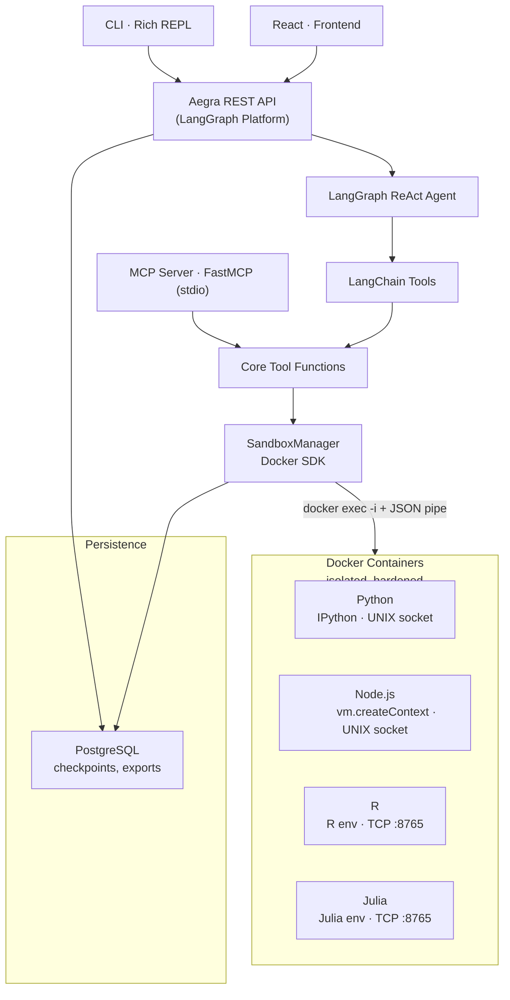
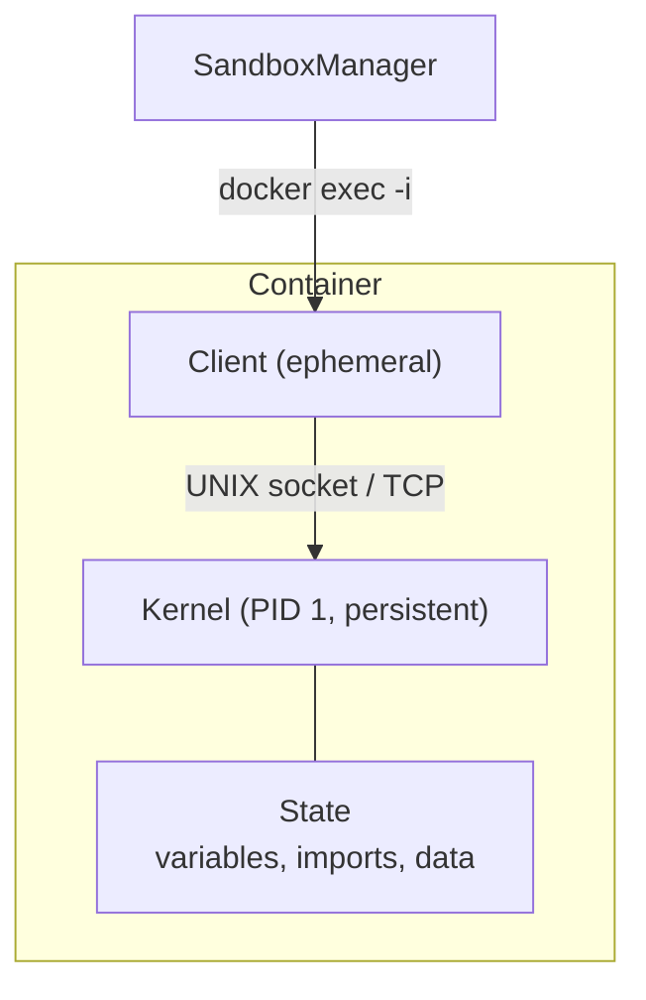

# Sandbox Agent

LangGraph agent with Docker-based sandboxed code execution. Each session runs in an isolated, hardened Docker container with a persistent kernel — IPython for Python, `vm.createContext` for Node.js, a dedicated R environment, and a Julia REPL. Supports 4 runtimes, provider-agnostic LLM configuration, and vision (auto-detection of multimodal models). Available as an interactive CLI, MCP server (Cursor, Claude Desktop), REST API ([Aegra](https://aegra.dev/)), and React frontend.

## Features

- **Docker isolation** — each session runs in its own container, no ports exposed, no host volumes
- **Hardened containers** — non-root user (UID 65532), PID limits, memory+swap limits, tmpfs-only writable dirs, `no-new-privileges`
- **Crash detection** — OOM-kill, fork bombs, segfaults are detected and reported clearly to the agent
- **Persistent state** — variables survive between code executions (like Jupyter cells)
- **Checkpointer PostgreSQL** — conversation history persists across restarts (shared with Aegra)
- **Async support** — Promises (Node.js) and coroutines (Python) are automatically awaited
- **Multi-runtime** — Python, Node.js, R, and Julia
- **Rich display outputs** — captures matplotlib/ggplot figures, Plotly charts, IPython Audio, HTML widgets, and more; auto-sends images to multimodal LLMs
- **Provider-agnostic** — works with OpenAI, Anthropic, Google Gemini, Ollama, or any compatible provider via `langchain init_chat_model`
- **Runtime package install** — `pip install` / `npm install` / `install.packages()` / `Pkg.add()` at session creation or via terminal
- **6 tools** — `create_session`, `execute_code`, `execute_terminal`, `import_files`, `export_files`, `stop_session`
- **MCP server** — expose the same tools via Model Context Protocol (stdio transport)
- **REST API** — full LangGraph Platform API via [Aegra](https://aegra.dev/) with OpenAPI docs, streaming, thread management
- **Input validation** — Pydantic schemas validate all tool inputs before execution, returning structured errors on failure
- **React frontend** — SPA with chat, tool visualization, file upload/download, settings dialog (React 19 + Vite + Tailwind CSS)
- **File upload** — upload files to the API for import into sandbox sessions (`POST /threads/{id}/files/upload`)
- **File export** — register files for download (no host copy); download via API or use in cross-session import
- **File import** — import from host paths, inline content, or from another session (files exported in same conversation)
- **Cross-session transfer** — export from session A, import into session B with `{session_id, path}`
- **Session garbage collection** — idle timeout, max lifetime, thread eviction, orphan container cleanup
- **Auto-cleanup** — all containers are stopped and removed when the agent exits

## Prerequisites

- Python 3.11+
- Docker Engine
- API key for your LLM provider (`CHAT_MODEL_API_KEY`)
- PostgreSQL (for API/CLI mode — checkpointer + Aegra)
- Node.js 18+ and npm (for the React frontend)

## Setup

```bash
# Docker — installs (if needed), configures permissions, and builds all 4 images
sudo ./setup-docker.sh

# Install Python dependencies (open a new terminal so the docker group is active)
uv sync

# Install frontend dependencies
cd frontend && npm install && cd ..

# Configure environment
cp .env.example .env
# Edit .env with your CHAT_MODEL_API_KEY, POSTGRES_PASSWORD, and other settings

# Docker images are also built automatically on first use if not already present
```

### PostgreSQL (required for CLI, API, and UI)

PostgreSQL is auto-started via Docker Compose when using `localhost`. The CLI detects if PostgreSQL is reachable and starts it automatically:

```bash
# Manual start (if needed)
docker compose up postgres -d
```

Or point to an existing PostgreSQL instance via `POSTGRES_*` env vars in `.env`.

## Usage

All commands use the unified `sandbox-agent` entry point:

```bash
uv run sandbox-agent cli       # Interactive CLI (default)
uv run sandbox-agent mcp       # MCP server (Cursor, Claude Desktop)
uv run sandbox-agent api       # REST API (Aegra, no reload)
uv run sandbox-agent api dev   # REST API with hot reload
uv run sandbox-agent ui        # React UI (auto-starts API if needed)
```

### CLI

```bash
uv run sandbox-agent cli
# or simply
uv run sandbox-agent
```

The CLI operates as a thin client on top of the Aegra REST API. Requires the API to be running (`uv run sandbox-agent api`). Features:

- [Rich](https://github.com/Textualize/rich) panels with syntax-highlighted tool I/O (per-runtime lexer)
- Streaming agent output with Markdown rendering
- Persistent thread across restarts (`~/.local/state/sandbox-agent/cli-thread.json`)
- `/new` command to start a fresh conversation
- Passes model/provider/key settings to the API via `configurable`

### MCP Server

Run the MCP server (stdio transport) for integration with Cursor, Claude Desktop, or any MCP-compatible client:

```bash
uv run sandbox-agent mcp
```

#### Cursor or Claude Desktop

Add the following MCP config:

```json
{
  "mcpServers": {
    "sandbox-agent": {
      "command": "uv",
      "args": ["--directory", "/path/to/sandbox-agent", "run", "sandbox-agent", "mcp"]
    }
  }
}
```

The MCP server exposes the same 6 tools as the CLI agent with identical behavior. It maintains a persistent thread_id in `~/.local/state/sandbox-agent/mcp-thread.json` for export URL consistency.

The `import_files` tool accepts file content directly (as text or base64 via `file_content`/`encoding` keys), host paths (via `source`/`destination`), or cross-session references (`session_id`+`path`). The `export_files` tool registers files for download via `GET /threads/{thread_id}/files/download?session_id=...&path=...`.

### REST API (Aegra)

Run the agent as a REST API via [Aegra](https://aegra.dev/) (self-hosted LangGraph Platform alternative):

```bash
uv run sandbox-agent api       # Production mode (no reload, auto-starts PostgreSQL)
uv run sandbox-agent api dev   # Development mode (hot reload via aegra dev)
```

The production command auto-starts PostgreSQL via Docker Compose if it's not reachable on localhost. The server runs at `http://localhost:8000` with OpenAPI docs at `/docs`. Use the LangGraph SDK or curl to create assistants, threads, and stream runs. Compatible with Agent Chat UI, LangGraph Studio, and CopilotKit.

Custom endpoints:

- `GET /threads/{thread_id}/files/download?session_id=...&path=...` — streams exported files from containers
- `POST /threads/{thread_id}/files/upload` — uploads files to be available for import into sandbox sessions
- `DELETE /threads/{thread_id}` — also cleans up Docker sessions and storage for that thread (via middleware)

### React Frontend

A web UI for chatting with the agent via the Aegra API (React 19 + Vite + Tailwind CSS):

```bash
# Install frontend dependencies (if not done during setup)
cd frontend && npm install && cd ..

# Start the UI (auto-starts API + PostgreSQL if needed)
uv run sandbox-agent ui
```

The frontend runs at `http://localhost:5173` (Vite dev server with API proxy to `:8000`). Features:

- Thread management (create, resume, delete conversations) via sidebar
- Streaming responses with expandable tool blocks (syntax-highlighted per runtime)
- File upload and download support
- Thinking block visualization
- Settings dialog (model, provider, API key, base URL, vision toggle)
- Persistent config via `localStorage`

### Programmatic

```python
from sandbox_agent.sandbox import SandboxManager

manager = SandboxManager()

info = manager.create_session(
    runtime="python",
    dependencies={"pandas": "2.2.3", "matplotlib": ""},
)
sid = info.session_id

r1 = manager.execute_code(sid, """
import pandas as pd
df = pd.DataFrame({'x': [1, 2, 3], 'y': [4, 5, 6]})
print(df.describe())
""")
print(r1.stdout)

# Variables persist between calls
r2 = manager.execute_code(sid, "df.shape")
print(r2.result)

# Export files from the sandbox (registers for download, no host copy)
manager.execute_code(sid, "df.to_csv('/workspace/output.csv', index=False)")
export = manager.export_files(sid, [{"source": "output.csv"}])
print(export.files[0].session_id, export.files[0].path)

manager.stop_session(sid)
```

#### Exporting Files

`export_files` registers files for download and cross-session import (no host copy). Files become available via the API (`GET /threads/{thread_id}/files/download?session_id=...&path=...`) and for `import_files` in other sessions:

```python
# Export a single file
result = manager.export_files(sid, [{"source": "report.pdf"}])

# Export an entire directory
result = manager.export_files(sid, [{"source": "results/"}])

# Export multiple files at once
result = manager.export_files(sid, [
    {"source": "data.csv"},
    {"source": "chart.png"},
    {"source": "/workspace/logs/"},
])

for f in result.files:
    print(f"{f.session_id}:{f.path} ({'OK' if f.success else f.error})")
```

#### Cross-Session File Transfer

Use `export_files` + `import_files` to move files between sessions (even across different runtimes):

```python
# Session A (Python): produce data
sid_a = manager.create_session(runtime="python", dependencies={"pandas": ""}).session_id
manager.execute_code(sid_a, """
import pandas as pd
df = pd.DataFrame({'x': [1,2,3], 'y': [4,5,6]})
df.to_csv('/workspace/data.csv', index=False)
""")
export = manager.export_files(sid_a, [{"source": "data.csv"}])
path = export.files[0].path  # /workspace/data.csv

# Session B (R): consume the same data
sid_b = manager.create_session(runtime="r", dependencies={"readr": ""}).session_id
manager.import_files(sid_b, [{"session_id": sid_a, "path": path, "destination": "data.csv"}])
manager.execute_code(sid_b, 'df <- readr::read_csv("/workspace/data.csv"); summary(df)')
```

#### Importing Files

`import_files` copies files into the sandbox from the host or from another session:

```python
# Import from host
result = manager.import_files(sid, [
    {"source": "/home/user/data.csv", "destination": "data.csv"},
    {"source": "/home/user/project/", "destination": "project/"},
])

# Import from another session (file must have been exported first)
result = manager.import_files(sid, [
    {"session_id": "abc123", "path": "/workspace/out.csv", "destination": "out.csv"},
])
```

Other runtimes work the same way — pass `runtime="node"`, `runtime="r"`, or `runtime="julia"` to `create_session`.

### Async Code

**Node.js** — if the last expression returns a Promise, the kernel awaits it before collecting output. Top-level `await` is also supported (falls back to an async IIFE wrapper when needed).

```javascript
const axios = require('axios');
async function fetchData() {
    const resp = await axios.get('https://api.example.com/data');
    console.log(resp.data);
}
fetchData(); // Promise is awaited automatically
```

**Python** — IPython's `autoawait` handles top-level `await`. If a cell returns an unawaited coroutine, the kernel detects it and runs it with `asyncio.run()`.

```python
import aiohttp

async def fetch_data():
    async with aiohttp.ClientSession() as session:
        resp = await session.get('https://api.example.com/data')
        print(await resp.text())

fetch_data()  # coroutine is detected and executed automatically
```

## Container Security

Each container is created with the following protections:

| Protection | Setting | Effect |
|---|---|---|
| Memory limit | `2048m` (no swap) | OOM-kill on overflow, host unaffected |
| PID limit | `512` | Fork bombs are contained and killed |
| CPU quota | `2` cores | Prevents CPU starvation on host |
| Writable dirs | tmpfs only (`/workspace`, `/tmp`, `/home/sandbox`) | Cannot fill host disk |
| tmpfs size | `200m` per mount | Limits in-container disk usage |
| User | `sandbox` (UID 65532) | No root inside container |
| Privileges | `no-new-privileges` | Cannot escalate via setuid/setgid |
| Network | Configurable (enabled by default) | Can be disabled per session |

When a container crashes, the agent receives a clear `CONTAINER_DIED` error with the reason (OOM-killed, SIGKILL, segfault, etc.) and a hint to recreate the session.

## Session Lifecycle

Sessions are automatically managed with garbage collection:

| Behavior | Default | Setting |
|---|---|---|
| Idle timeout | 30 min | `SESSION_IDLE_TTL_SECONDS` |
| Max lifetime | 2 hours | `SESSION_MAX_LIFETIME_SECONDS` |
| GC interval | 60 sec | `SESSION_GC_INTERVAL_SECONDS` |
| Max active threads | 10 | `SESSION_MAX_ACTIVE_THREADS` |
| Max sessions (global) | 5 | `CONTAINER_MAX_SESSIONS` |
| Max sessions per thread | 3 | `CONTAINER_MAX_SESSIONS_PER_THREAD` |
| Orphan cleanup age | 5 min | `CONTAINER_ORPHAN_MIN_AGE_SECONDS` |

On startup, the manager removes orphan containers older than the minimum age. On exit, all containers are stopped and removed via `atexit` and signal handlers (`SIGTERM`/`SIGINT`).

## Configuration

All settings can be overridden via environment variables or `.env`. Defaults are shown from `settings.py`:

```bash
# ── LLM (provider-agnostic) ──
CHAT_MODEL=gpt-4o                    # Model name
CHAT_MODEL_PROVIDER=openai           # Provider: openai, anthropic, google_genai, ollama
CHAT_MODEL_API_KEY=sk-...            # API key (required)
CHAT_MODEL_BASE_URL=                 # Custom API base URL (optional)
CHAT_MODEL_SUPPORTS_VISION=          # Override vision detection (true/false, empty = auto)

# ── Container Limits ──
CONTAINER_MEMORY_LIMIT=2048m         # Docker memory limit (no swap)
CONTAINER_CPU_QUOTA=200000           # CPU quota (100000 = 1 core)
CONTAINER_PIDS_LIMIT=512             # Max PIDs per container
CONTAINER_TMPFS_SIZE=200m            # tmpfs size for writable dirs
CONTAINER_EXECUTION_TIMEOUT_SECONDS=30  # Default code execution timeout
CONTAINER_MAX_SESSIONS=5             # Max concurrent sessions (global)
CONTAINER_MAX_SESSIONS_PER_THREAD=3  # Max sessions per conversation
CONTAINER_EXECUTE_AS_ROOT=False      # Run terminal commands as root
CONTAINER_ORPHAN_MIN_AGE_SECONDS=300 # Min age before orphan cleanup (5 min)

# ── Session Lifecycle / GC ──
SESSION_IDLE_TTL_SECONDS=1800        # Idle timeout (30 min)
SESSION_MAX_LIFETIME_SECONDS=7200    # Hard lifetime cap (2 hours)
SESSION_GC_INTERVAL_SECONDS=60       # GC check interval
SESSION_MAX_ACTIVE_THREADS=10        # Max active threads before eviction

# ── Output Truncation (characters) ──
MAX_STDOUT_CHARS=20000
MAX_STDERR_CHARS=10000
MAX_RESULT_CHARS=20000
MAX_TRACEBACK_CHARS=5000

# ── Storage ──
STORAGE_DIR=./storage                # Base dir for uploads

# ── API ──
API_BASE_URL=http://127.0.0.1:8000   # API URL (for export download URLs)

# ── Agent ──
MAX_ITERATIONS=25                    # Max LangGraph iterations (recursion limit)

# ── PostgreSQL (checkpointer + Aegra) ──
POSTGRES_USER=sandbox_agent
POSTGRES_PASSWORD=sandbox_agent_secret
POSTGRES_DB=sandbox_agent
POSTGRES_HOST=localhost
POSTGRES_PORT=5432
```

## Runtimes

| Runtime | Base Image | Kernel | IPC | Pre-installed |
|---|---|---|---|---|
| Python | `python:3.12-slim` | IPython shell | UNIX socket | IPython + system libs |
| Node.js | `node:22-slim` | `vm.createContext` | UNIX socket | Bare runtime |
| R | `rocker/r-ver:4` | Dedicated R env | TCP `:8765` | tidyverse, data.table, ggplot2, readxl, haven, httr2, DBI, RSQLite, rmarkdown, knitr, devtools, glmnet, randomForest |
| Julia | `julia:1.11-bookworm` | Julia REPL | TCP `:8765` | JSON3, DataFrames, CSV, RDatasets, Statistics, StatsBase, Distributions, HypothesisTests, HTTP, BenchmarkTools |

R and Julia containers use a compiled C client binary for IPC, while Python and Node.js use native clients.

## Architecture



Inside each container, a persistent **kernel** (PID 1) holds execution state, and an ephemeral **client** connects to it via UNIX socket (Python/Node.js) or TCP (R/Julia) for each `docker exec` call:



## Testing

```bash
# Unit tests (no Docker required)
uv run pytest tests/test_cli.py tests/test_http_app.py -v

# Integration tests (requires Docker)
uv run pytest tests/test_manager.py tests/test_tools.py tests/test_export_files.py tests/test_mcp.py -v

# Full suite
uv run pytest tests/ -v
```

## Production Deployment

A production `Dockerfile` and `docker-compose.yml` are included:

```bash
# Start PostgreSQL + API
docker compose up -d

# Or build and run manually
docker build -t sandbox-agent-api .
docker run -p 8000:8000 --env-file .env sandbox-agent-api
```

The production image uses `aegra serve` with a non-root `app` user.

## License

[MIT](LICENSE) — Eduardo Ramon Resser
