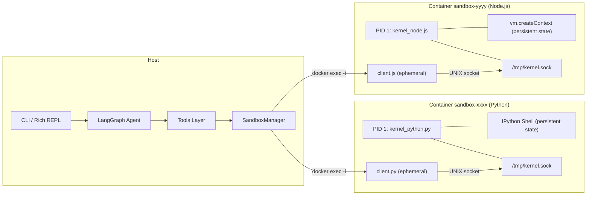

# Sandbox Agent

LangGraph agent with Docker-based sandboxed code execution. Each session is an isolated Docker container with a persistent kernel (IPython for Python, vm.createContext for Node.js).

## Features

- **Docker isolation** — each session runs in its own container, no ports exposed
- **Persistent state** — variables survive between code executions (like Jupyter cells)
- **Multi-runtime** — Python and Node.js support
- **5 tools** — create_session, execute_code, execute_terminal, upload_file, stop_session
- **Auto-cleanup** — all containers are stopped and removed when the agent exits

## Prerequisites

- Python 3.11+
- Docker Engine
- OpenAI API key

## Setup

```bash
# Docker — installs (if needed) and configures permissions
sudo ./setup-docker.sh

# Install dependencies (open a new terminal so the docker group is active)
uv sync

# Configure environment
cp .env.example .env
# Edit .env with your OPENAI_API_KEY

# Docker images are built automatically on first use
```

## Usage

### CLI

```bash
sandbox-agent
```

### Programmatic

```python
from sandbox_agent.sandbox import SandboxManager

manager = SandboxManager()

info = manager.create_session(
    runtime="python",
    dependencies={"pandas": "2.2.3", "matplotlib": ""},
)
sid = info.session_id

r1 = manager.execute_code(sid, """
import pandas as pd
df = pd.DataFrame({'x': [1, 2, 3], 'y': [4, 5, 6]})
print(df.describe())
""")
print(r1.stdout)

# Variables persist between calls
r2 = manager.execute_code(sid, "df.shape")
print(r2.result)

manager.stop_session(sid)
```

## Architecture



## Testing

```bash
# Requires Docker running
pytest tests/ -v
```
