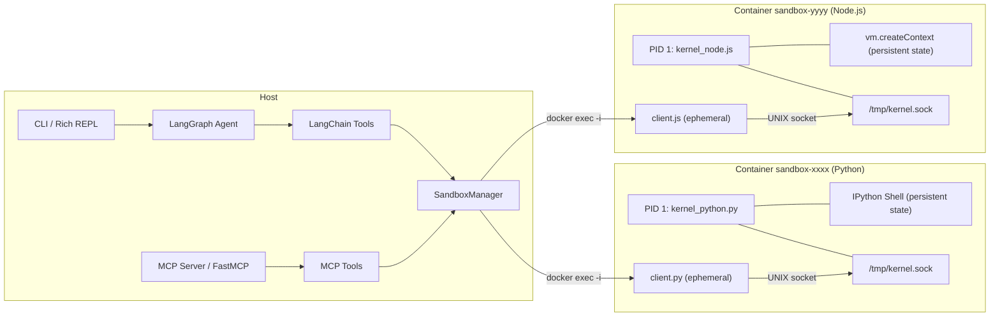

# Sandbox Agent

LangGraph agent with Docker-based sandboxed code execution. Each session is an isolated Docker container with a persistent kernel (IPython for Python, vm.createContext for Node.js). Available as an interactive CLI or as an MCP server for integration with Cursor, Claude Desktop, and other MCP-compatible clients.

## Features

- **Docker isolation** — each session runs in its own container, no ports exposed, no host volumes
- **Hardened containers** — non-root user, PID limits, memory+swap limits, tmpfs-only writable dirs, `no-new-privileges`
- **Crash detection** — OOM-kill, fork bombs, segfaults are detected and reported clearly to the agent
- **Persistent state** — variables survive between code executions (like Jupyter cells)
- **Async support** — Promises (Node.js) and coroutines (Python) are automatically awaited
- **Multi-runtime** — Python and Node.js support
- **Runtime package install** — `pip install` / `npm install` work both at session creation and via terminal
- **5 tools** — create_session, execute_code, execute_terminal, upload_file, stop_session
- **MCP server** — expose the same tools via Model Context Protocol (stdio transport)
- **Auto-cleanup** — all containers are stopped and removed when the agent exits

## Prerequisites

- Python 3.11+
- Docker Engine
- API key for your LLM provider (`CHAT_MODEL_API_KEY`)

## Setup

```bash
# Docker — installs (if needed) and configures permissions
sudo ./setup-docker.sh

# Install dependencies (open a new terminal so the docker group is active)
uv sync

# Configure environment
cp .env.example .env
# Edit .env with your CHAT_MODEL_API_KEY and LLM settings

# Docker images are built automatically on first use
```

## Usage

### CLI

```bash
uv run sandbox-agent
```

### MCP Server

Run the MCP server (stdio transport) for integration with Cursor, Claude Desktop, or any MCP-compatible client:

```bash
uv run sandbox-agent-mcp
```

#### Cursor

Add to `~/.cursor/mcp.json`:

```json
{
  "mcpServers": {
    "sandbox-agent": {
      "command": "uv",
      "args": ["--directory", "/path/to/sandbox-agent", "run", "sandbox-agent-mcp"]
    }
  }
}
```

#### Claude Desktop

Add to the Claude Desktop MCP config:

```json
{
  "mcpServers": {
    "sandbox-agent": {
      "command": "uv",
      "args": ["--directory", "/path/to/sandbox-agent", "run", "sandbox-agent-mcp"]
    }
  }
}
```

The MCP server exposes the same 5 tools as the CLI agent. The `upload_file` tool accepts file content directly (as text or base64) since MCP clients don't share a filesystem with the server.

### Programmatic

```python
from sandbox_agent.sandbox import SandboxManager

manager = SandboxManager()

info = manager.create_session(
    runtime="python",
    dependencies={"pandas": "2.2.3", "matplotlib": ""},
)
sid = info.session_id

r1 = manager.execute_code(sid, """
import pandas as pd
df = pd.DataFrame({'x': [1, 2, 3], 'y': [4, 5, 6]})
print(df.describe())
""")
print(r1.stdout)

# Variables persist between calls
r2 = manager.execute_code(sid, "df.shape")
print(r2.result)

manager.stop_session(sid)
```

### Async Code

Both runtimes handle asynchronous code transparently:

**Node.js** — if the last expression returns a Promise, the kernel awaits it before collecting output. Top-level `await` is also supported (falls back to an async IIFE wrapper when needed).

```javascript
const axios = require('axios');
async function fetchData() {
    const resp = await axios.get('https://api.example.com/data');
    console.log(resp.data);
}
fetchData(); // Promise is awaited automatically
```

**Python** — IPython's `autoawait` handles top-level `await`. If a cell returns an unawaited coroutine, the kernel detects it and runs it with `asyncio.run()`.

```python
import aiohttp

async def fetch_data():
    async with aiohttp.ClientSession() as session:
        resp = await session.get('https://api.example.com/data')
        print(await resp.text())

fetch_data()  # coroutine is detected and executed automatically
```

## Container Security

Each container is created with the following protections:

| Protection | Setting | Effect |
|---|---|---|
| Memory limit | `512m` (no swap) | OOM-kill on overflow, host unaffected |
| PID limit | `128` | Fork bombs are contained and killed |
| CPU quota | `50%` of 1 core | Prevents CPU starvation on host |
| Writable dirs | tmpfs only (`/workspace`, `/tmp`, `/home/sandbox`) | Cannot fill host disk |
| tmpfs size | `200m` per mount | Limits in-container disk usage |
| User | `sandbox` (UID 65532) | No root inside container |
| Privileges | `no-new-privileges` | Cannot escalate via setuid/setgid |
| Network | Configurable (enabled by default) | Can be disabled per session |

When a container crashes, the agent receives a clear `CONTAINER_DIED` error with the reason (OOM-killed, SIGKILL, segfault, etc.) and a hint to recreate the session.

## Configuration

All settings can be overridden via environment variables or `.env`:

```bash
# LLM (provider-agnostic)
CHAT_MODEL=gpt-4o
CHAT_MODEL_PROVIDER=openai
CHAT_MODEL_BASE_URL=
CHAT_MODEL_API_KEY=sk-...

# Container
CONTAINER_MEMORY_LIMIT=512m
CONTAINER_CPU_QUOTA=50000
CONTAINER_PIDS_LIMIT=128
CONTAINER_TMPFS_SIZE=200m
EXECUTION_TIMEOUT_SECONDS=30
MAX_SESSIONS=5
```

## Architecture



## Testing

```bash
# Requires Docker running
uv run pytest tests/ -v
```
